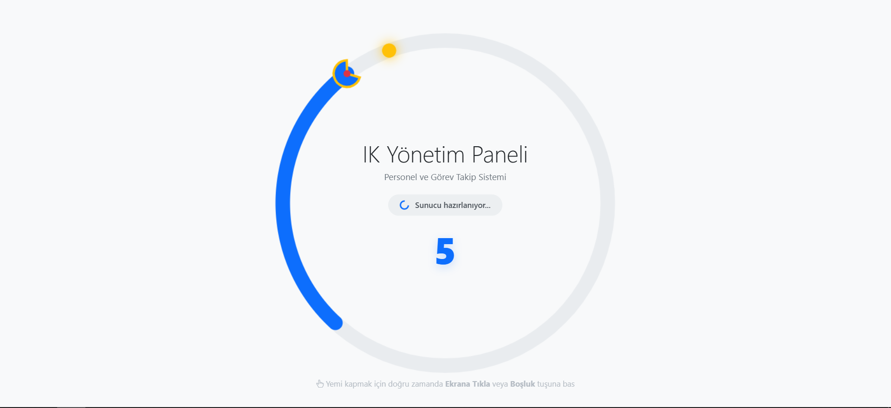

# IK Intranet App - Gateway & Cold Start Manager

This project is a static "Lobby" interface designed to manage **"Cold Start" latency** and improve User Experience (UX) for the **IK Intranet App** (.NET Core) application.

## 🎯 Purpose & The "Cold Start" Solution

Our main application is hosted on the **Render.com Free Tier**. To save resources, Render spins down the server after periods of inactivity. Waking the server up can take **30-40 seconds** (Cold Start).

Instead of letting the user stare at a blank screen or a static loading bar during this delay, I designed a **Gamified Loading Screen**. This keeps the user engaged while the backend wakes up in the background.

## 🛠️ How It Works

1.  **Static Hosting:** This gateway is hosted on **GitHub Pages**, ensuring it loads instantly.
2.  **Server Waking:** The moment the page opens, a background `fetch` request pings the main server to wake it up.
3.  **Wait Management:** While the server is spinning up, the user plays the **Spinner Snake** game.
4.  **Auto Redirect:** Once the server responds (HTTP 200), the game stops, a "System Ready" success message appears, and the user is automatically redirected to the main application.

## 🐍 Spinner Snake Game Features

I created a custom circular snake game that functions as an interactive loading spinner.

* **Dynamic UI:** The snake moves in a continuous circle, mimicking a traditional loading spinner.
* **Visual Details:** Features "Pac-Man" style mouth animations, neon highlights upon interaction, and cute details like a "blep" tongue effect.
* **Anti-Spam Mechanism:** Implements a **Cooldown system** and ignores key repeats to prevent button mashing, encouraging strategic timing ("Sniper Mode").
* **Responsive Design:** Runs as a Full-Screen Canvas that adapts seamlessly to both mobile and desktop screens.

## 📸 Screenshot

*(Please add a screenshot of the game named 'screenshot.png' to the root directory)*

## 💻 Technologies

* **HTML5 Canvas API:** For the game engine and rendering.
* **Vanilla JavaScript (ES6+):** For game logic and asynchronous server checks.
* **Bootstrap 5:** For UI components and responsive layout.
* **Fetch API:** For handling Cross-Origin (CORS) server requests.

## 🔗 Live Demo

You can try the game and wake up the server here:
[IK Intranet App - Gateway](https://oguzanilates.github.io/IK_Intranet_Gateway/)

---
*This project demonstrates how technical constraints can be turned into creative UX advantages.*
